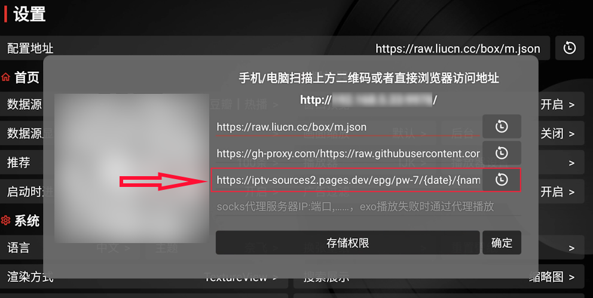
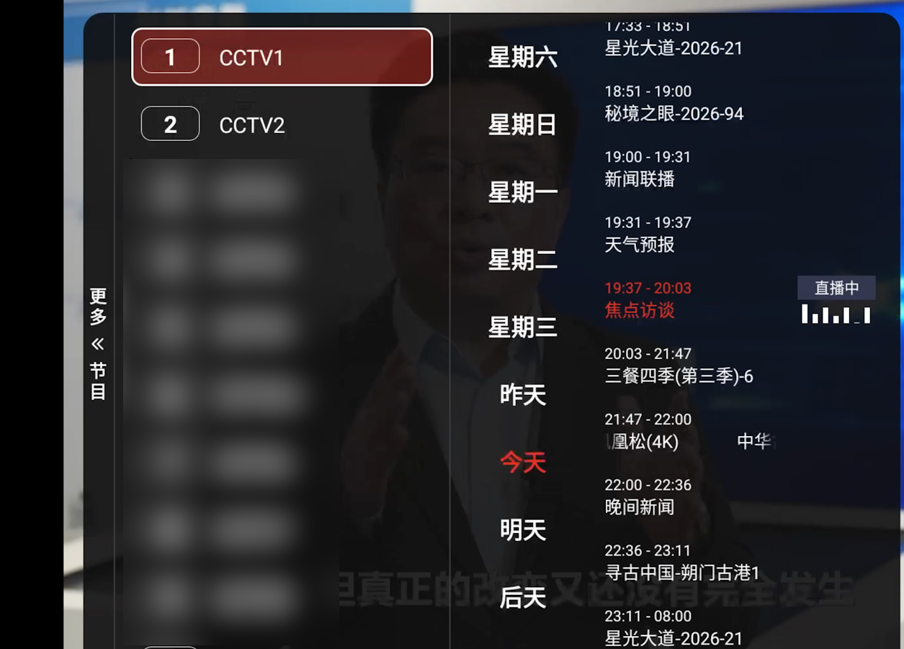

# tvbox 7 天 EPG 上线
yunnysunny/iptv-sources 发布以来，因为其能免费提供 tvbox 的 EPG 服务，所以受到很多粉丝的关注。但同时有粉丝提出现在的 EPG 数据只包含当天的节目预告，能否提供未来几天的预告呢？因此我这些天重新研究了一下公开的 API，发现 epg.pw 提供了任意天的 EPG 数据，所以就迫不及待将此功能开发出来。

我已经将项目布署在 cloudflare pages 上，大家在 tvbox 中将 epg 地址配置成 `https://iptv-sources2.pages.dev/epg/pw-7/{date}/{name}.json` 即可。

图 1 配置界面

图 2 展示效果

有一个小问题，tvbox 显示的是 9 天的节目预告，但是 epg.pw 只提供了 7 天的预告，所以 tvbox 中`后天` 和 6 天前的节目预告会没有反应。